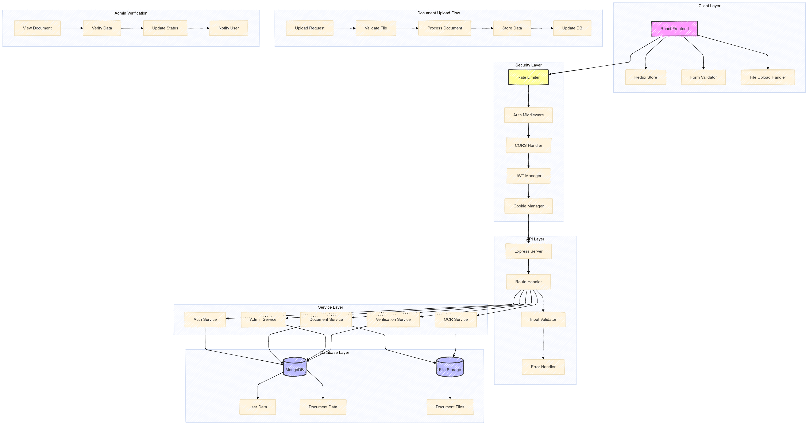
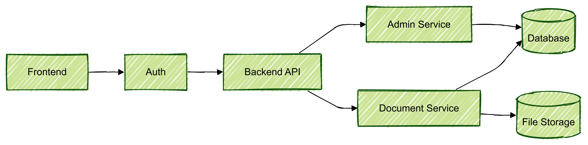
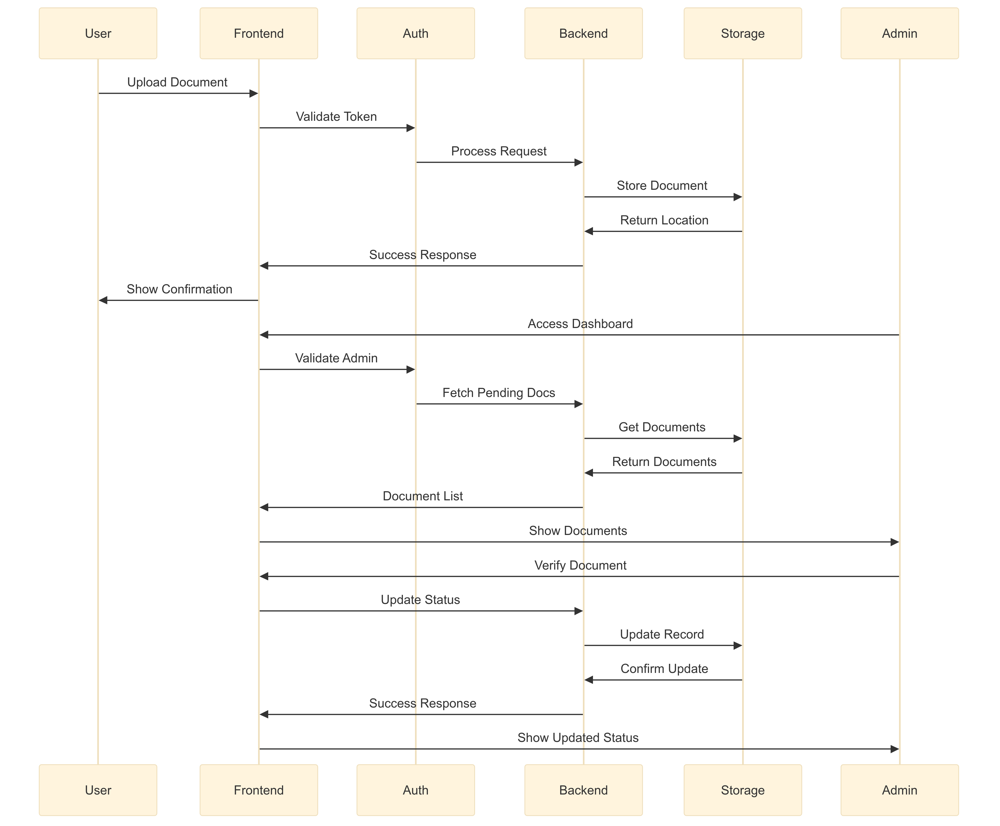

# DocVerify - Secure Document Verification System

A robust document verification system built with the MERN stack that provides secure document storage, OCR-based information extraction, and an admin verification workflow.

## 🌟 Features

- 🔒 Secure document upload and storage
- 📝 Automated information extraction using OCR
- 👥 Role-based access control (Admin/User)
- 🕒 Time-limited document viewing
- 🔐 Encrypted document information
- 📊 Admin verification dashboard
- 🔍 Search and filter capabilities
- 📱 Responsive design

## Live Demo

- Frontend: https://docu-verify.vercel.app
- Backend: https://docuverify-backend.onrender.com

## 🏗 System Architecture



## 🔄 Document Flow



## 🛠 Technology Stack

### Frontend

- React.js
- Redux Toolkit
- TailwindCSS
- DaisyUI
- Axios
- React Router DOM

### Backend

- Node.js
- Express.js
- MongoDB
- JWT Authentication
- Tesseract.js (OCR)
- Sharp (Image Processing)
- Multer (File Upload)

### Security Features

- Rate Limiting
- CORS Protection
- HTTP-Only Cookies
- AES-256 Encryption
- XSS Protection
- Input Validation

## 📋 Prerequisites

- Node.js (v14 or higher)
- MongoDB
- NPM or Yarn
- Tesseract.js dependencies

## 🚀 Installation

1. Clone the repository

```bash
git clone https://github.com/Pratik228/DocuVille
cd DocuVille
```

2. Install backend dependencies

```bash
cd backend
npm install
```

3. Install frontend dependencies

```bash
cd frontend
npm install
```

4. Set up environment variables

Backend (.env):

```env
PORT=8000
MONGODB_URI=your_mongodb_uri
JWT_SECRET=your_jwt_secret
ENCRYPTION_KEY=your_encryption_key
BASE_URL=http://localhost:8000
```

Frontend (.env):

```env
VITE_API_URL=http://localhost:8000/api
```

5. Create uploads directory

```bash
mkdir uploads
```

## 🏃‍♂️ Running the Application

1. Start the backend server

```bash
cd backend
npm run dev
```

2. Start the frontend application

```bash
cd frontend
npm run dev
```

## 🔨 Usage

### User Flow

1. Register/Login to the system
2. Upload documents
3. View extracted information
4. Request time-limited document views
5. Track document verification status

### Admin Flow

1. Login as admin
2. View all uploaded documents
3. Verify or reject documents
4. Add verification notes
5. Access complete document history



## 🔍 OCR Capabilities

The system uses Tesseract.js for OCR with enhanced features:

- Text extraction
- Document number detection
- Name extraction
- Gender identification
- Date parsing
- Multi-language support

## 🔐 Security Measures

1. Document Security

   - Encrypted storage
   - Masked document numbers
   - Time-limited viewing
   - View count restrictions

2. User Security

   - JWT authentication
   - HTTP-only cookies
   - Rate limiting
   - Input validation

3. Storage Security
   - Encrypted file paths
   - Secure file naming
   - Automatic file cleanup

## 🎯 Business Use Cases

1. HR Departments

   - Employee document verification
   - ID management
   - Compliance tracking

2. Financial Institutions

   - KYC verification
   - Document authentication
   - Customer onboarding

3. Educational Institutions

   - Student document verification
   - Certificate authentication
   - Record keeping

4. Government Agencies
   - ID verification
   - Document processing
   - Record management

## 🔮 Future Enhancements

1. AI/ML Integration

   - Advanced document forgery detection
   - Automated verification suggestions
   - Pattern recognition
   - Anomaly detection

2. Additional Features

   - Blockchain integration for verification
   - Multi-language support
   - Batch processing
   - API access for third-party integration
   - Mobile app support

3. Security Enhancements

   - Biometric authentication
   - Document watermarking
   - Advanced encryption
   - Audit logging

4. Performance Optimizations
   - Caching layer
   - Load balancing
   - CDN integration
   - Image optimization

## 🌐 API Documentation

### Authentication

```
POST /api/auth/register - Register new user
POST /api/auth/login - Login user
POST /api/auth/logout - Logout user
```

### Documents

```
POST /api/docs/upload - Upload new document
GET /api/docs - Get user's documents
PATCH /api/docs/:id/verify - Verify document (admin)
POST /api/docs/:id/view - Request document view
GET /api/docs/view - View document with token
```

## 📦 Deployment Considerations

1. Server Requirements

   - Node.js environment
   - MongoDB database
   - Storage for uploads
   - SSL certificate

2. Environment Setup

   - Configure environment variables
   - Set up MongoDB indexes
   - Configure CORS
   - Set up rate limiting

3. Security Checklist
   - Enable HTTPS
   - Configure firewalls
   - Set up monitoring
   - Configure backup systems

## 📧 Contact

- Email: pratikmishra79.email@example.com
- GitHub: pratik228
